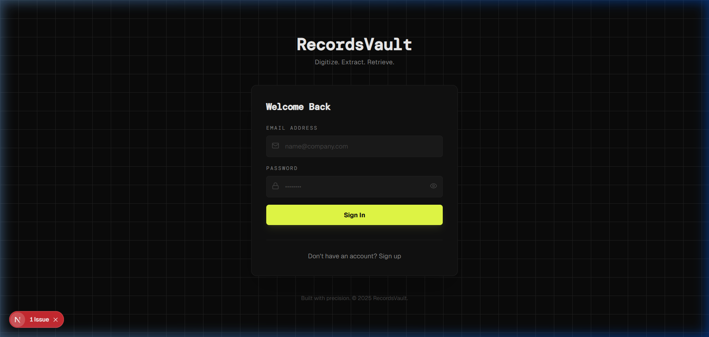
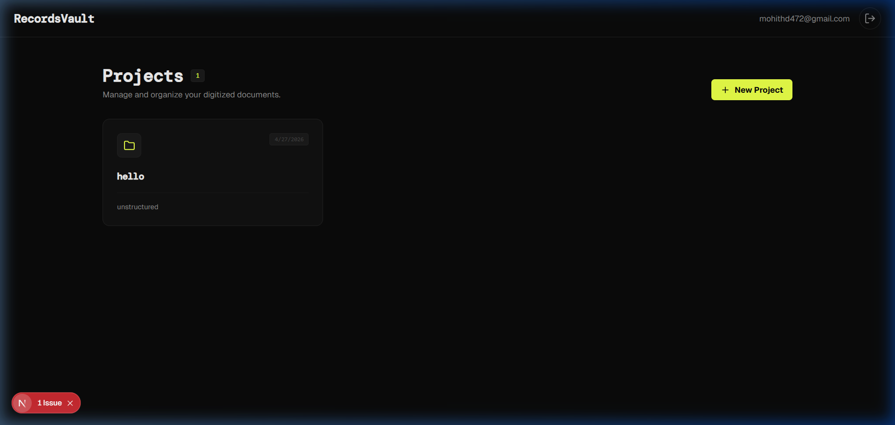
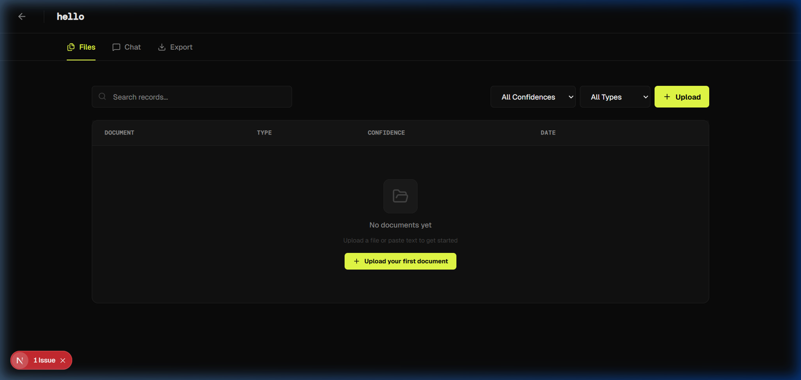

# RecordsVault — Digitize. Extract. Retrieve.

**RecordsVault** is a full-stack AI-powered document digitization platform. Upload physical documents as PDFs, images, or raw text, and the system automatically extracts, processes, and indexes the content — making your records searchable and queryable through natural language.

---

## 🖼️ Screenshots

### Login Page


### Projects Dashboard


### Project — Files & Upload


---

## ✨ Features

- **Multi-format Upload** — Supports PDFs, images (JPG, PNG), CSVs, and plain text.
- **OCR Extraction** — Uses [Tesseract.js](https://github.com/naptha/tesseract.js) to extract text from scanned images.
- **PDF Parsing** — Automatically parses and extracts text from PDF files via `pdf-parse`.
- **AI Processing** — Uses [Groq](https://groq.com) (LLaMA 3) to summarize, clean, and structure extracted content.
- **Semantic Search** — Generates vector embeddings via `@xenova/transformers` (MiniLM-L6) for semantic document retrieval.
- **AI Chat** — Ask natural language questions about your documents within each project.
- **Export** — Export processed records as JSON or CSV.
- **Authentication** — Secure user login, signup, and session management via Supabase Auth.
- **Per-user Data** — All projects and records are scoped to the authenticated user with Supabase RLS.

---

## 🛠️ Tech Stack

| Layer | Technology |
|---|---|
| Framework | [Next.js 16](https://nextjs.org) (App Router, Server Components) |
| Language | TypeScript |
| Styling | Tailwind CSS v4 |
| Database | [Supabase](https://supabase.com) (PostgreSQL + pgvector) |
| Auth | Supabase Auth |
| Storage | Supabase Storage |
| AI / LLM | [Groq API](https://groq.com) — LLaMA 3 |
| Embeddings | `@xenova/transformers` (Xenova/all-MiniLM-L6-v2) |
| OCR | [Tesseract.js](https://github.com/naptha/tesseract.js) |
| PDF Parsing | `pdf-parse` |
| Deployment | Vercel (frontend) / Render (backend) |

---

## 🗂️ Project Structure

```
src/
├── app/
│   ├── page.tsx                  # Dashboard (projects list)
│   ├── login/page.tsx            # Auth page (login + signup)
│   ├── auth/callback/route.ts    # OAuth callback handler
│   ├── projects/[id]/            # Project detail pages
│   │   ├── page.tsx              # Files, Chat, Export tabs
│   │   └── records/[recordId]/   # Individual record view
│   └── api/
│       ├── upload/               # File upload & storage
│       ├── process/              # AI processing pipeline
│       ├── chat/                 # AI chat endpoint
│       ├── export/               # Data export
│       ├── download/[id]/        # File download
│       ├── records/[id]/         # Record management
│       └── health/               # Health check (Render)
├── components/
│   ├── project/                  # ProjectCard, FilesTab, ChatPanel, ExportPanel
│   └── ui/                       # Reusable UI components
├── utils/supabase/
│   ├── server.ts                 # Server Component Supabase client
│   ├── client.ts                 # Browser Supabase client
│   ├── middleware.ts             # Session refresh middleware
│   └── admin.ts                  # Admin client (bypasses RLS)
└── lib/
    └── embedding.ts              # Vector embedding generation
```

---

## 🚀 Getting Started

### Prerequisites

- Node.js 18+
- A [Supabase](https://supabase.com) project
- A [Groq API](https://console.groq.com) key

### 1. Clone the Repository

```bash
git clone https://github.com/Mohiee661/digitalizing-physical-docs.git
cd digitalizing-physical-docs
```

### 2. Install Dependencies

```bash
npm install
```

### 3. Configure Environment Variables

Copy `env.example` to `.env.local` and fill in your credentials:

```bash
cp env.example .env.local
```

```env
NEXT_PUBLIC_SUPABASE_URL=your_supabase_project_url
NEXT_PUBLIC_SUPABASE_ANON_KEY=your_supabase_anon_key
SUPABASE_SERVICE_ROLE_KEY=your_supabase_service_role_key
GROQ_API_KEY=your_groq_api_key
NEXT_TELEMETRY_DISABLED=1
```

### 4. Set Up the Database

Run the SQL in `supabase_setup.sql` against your Supabase project to create the required tables (`projects`, `records`) and enable `pgvector`.

### 5. Run Locally

```bash
npm run dev
```

Open [http://localhost:3000](http://localhost:3000) in your browser.

---

## ☁️ Deployment

### Vercel

1. Connect your GitHub repository to [Vercel](https://vercel.com).
2. Set the environment variables in the Vercel dashboard (same as `.env.local`).
3. Deploy — Vercel auto-detects Next.js.

### Render

1. Create a new **Web Service** on [Render](https://render.com).
2. Set **Build Command**: `npm run build`
3. Set **Start Command**: `npm start`
4. Add environment variables in the Render dashboard.
5. The health check endpoint is available at `/api/health`.

See [DEPLOYMENT.md](DEPLOYMENT.md) for full details.

---

## 📄 License

MIT — feel free to use and modify.
